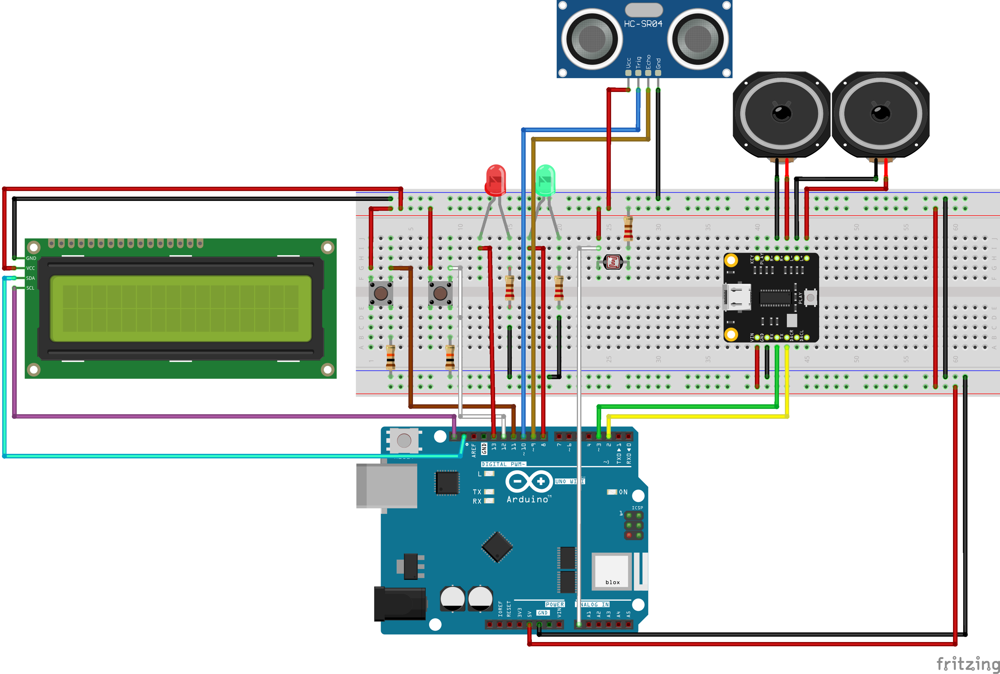
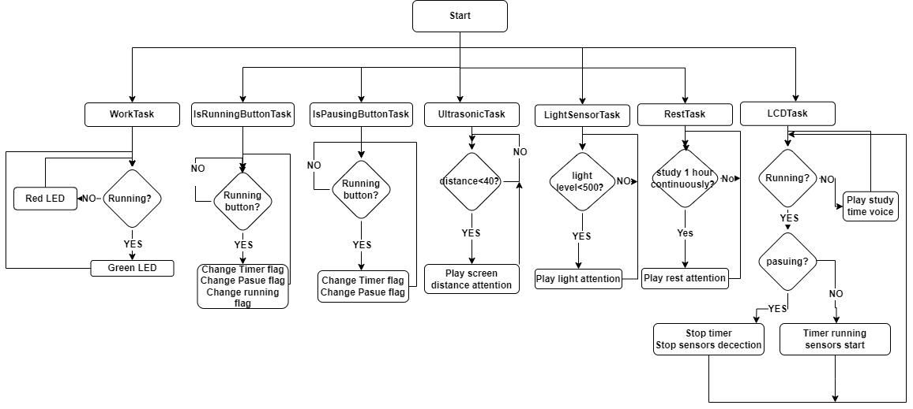
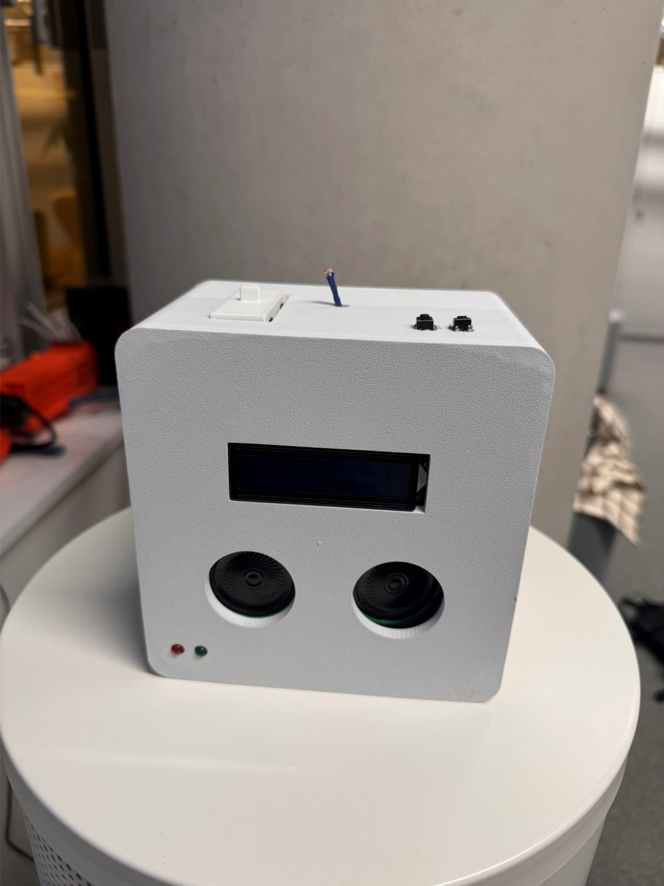

# Learning Environment Monitor

An Arduino-based project designed to create a Learning Environment Monitor to help user to keep a good study environment. And the whole system use the FreeRTOS to handle the Task.
This is the **CASA0016 Coursework**.

---

## 🌟 Features
- ✨ **Feature 1**: Audio Reminder: Keep a health distance with screen
- 🚀 **Feature 2**: Audio Reminder: Keep a bright environment
- 🔒 **Feature 3**: Audio Reminder: Take breaks after one hour 
- ✨ **Feature 4**: Use FreeRTOS
---
## Hardware and Components 🔧

- **Arduino Board**: Arduino Uno Wi-Fi 
- **Sensors**: Light sensor, Ultrasonic Sensor
- **Display**: LCD Screen
- **Resistance**: Two  220 Ω and Three 10K Ω
- **Audio Components**: DF0768 Player Pro and Two Speakers
- **Input/Output Components**: Two LEDs (Red LED and Green LED) and Two buttons
---
## Software and Libraries 🛠

- **IDE**: 
    - `Arduino IDE`
- **Libraries**: 
    - `Adafruit_GFX` 
    - `WiFiNINA`
    - `Wire`
    - `Adafruit_SSD1306`
    - `WiFiNINA`
    - `PubSubClient`
---
## Progress and Roadmap 🗓
- [x] Light sensor test
- [x] Ultrasonic Sensor test
- [x] LCD Screen test
- [x] FreeRTOS test
- [x] DF0768 Player Pro test
- [x] Combine all together
- [x] Use FreeRTOS to handle the all tasks and test the whole system
- [x] Design the encloser
- [x] Put the whole system into encloser 
- [x] Optimized encloser 
##### Circuit Diagram

##### Work Flow

### Demonstration:
[Video](https://github.com/mk20661/CASA0016/blob/main/readmeSrc/Demo.mp4)
<video width="400" controls autoplay>
    <source src="./readmeSrc/Demo.mp4" type="video/mp4">
</video>

#### Prototype

## License 📜
   
This project is licensed under the [MIT License](LICENSE).